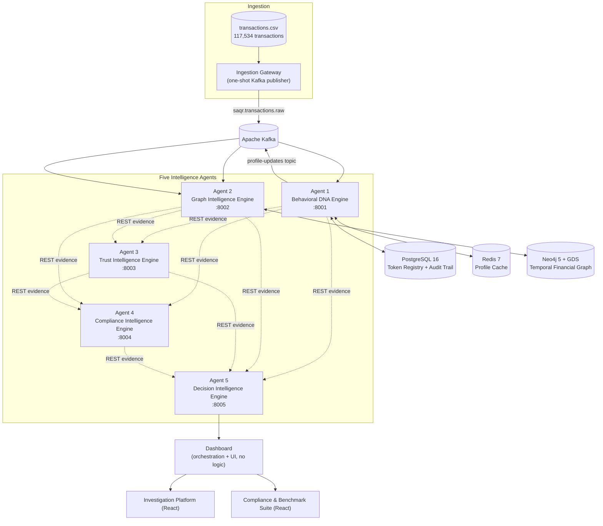
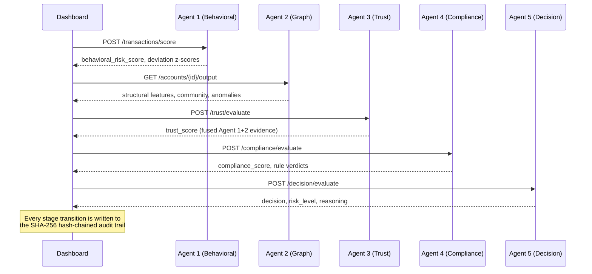

<div align="center">

# 🦅 SAQR 

### Multi-Agent Financial Crime Intelligence Platform

**A five-agent, evidence-fused pipeline for behavioral, structural, and regulatory transaction risk — built for the Saudi/GCC AML & fraud compliance context.**

[](https://www.python.org/)
[](https://fastapi.tiangolo.com/)
[](https://react.dev/)
[](https://neo4j.com/)
[](https://www.postgresql.org/)
[](https://kafka.apache.org/)
[](https://www.docker.com/)
[](#project-structure)

[Live Demo](https://187-124-191-149.sslip.io/) · [API Overview](#-api-overview) · [Architecture](#-multi-agent-ai-architecture) · [Benchmark Suite](#-benchmark--validation-suite)

</div>

---

## 1. Overview

SAQR is a financial crime intelligence platform built around a simple premise: **no single signal is enough to decide whether a transaction is risky, and no single agent should be trusted to decide alone.**

Instead of one monolithic fraud-scoring model, SAQR splits the problem into five narrowly-scoped, independently deployable services — each one responsible for exactly one kind of evidence — and fuses their outputs into a single, explainable, auditable decision. Every agent runs as its own FastAPI microservice, communicates over REST and Kafka, and is backed by real infrastructure: PostgreSQL, Neo4j with the Graph Data Science library, Redis, and Kafka.

This repository contains the full system: five intelligence agents, an orchestration dashboard, two React operator front-ends, a benchmark & production-readiness validation suite, a regulatory policy registry sourced from real Saudi and international AML/CTF publications, and a hardened Docker Compose deployment used to run the whole stack in production.

---

## 2. The Financial Problem

Anti-money-laundering and fraud-prevention systems at banks and payment providers have to answer one question, over and over, in real time: **is this transaction consistent with who this customer normally is, who they normally deal with, and what the regulator requires us to check?**

That question has at least three independent dimensions:

- **Behavioral** — is this transaction consistent with the customer's own historical pattern (amount, velocity, beneficiaries)?
- **Structural** — does this transaction sit inside a suspicious network shape (fan-in/fan-out, shared beneficiaries, tightly-connected communities)?
- **Regulatory** — does this transaction trigger a specific, citable rule (CDD threshold, sanctions screening, STR obligation)?

Getting any one of these wrong in either direction is expensive: false negatives are regulatory and reputational risk; false positives are lost legitimate customers and wasted investigator time.

## 3. Why Existing Systems Are Not Enough

Most production AML/fraud systems fall into one of two failure modes:

- **A single opaque model** scores the whole transaction at once. When it flags something, the compliance officer has no way to explain *why* to a regulator beyond "the model said so" — a real problem under SAMA and FATF expectations for explainable, auditable decisions.
- **A rules-only engine** is explainable but structurally blind — it has no concept of a customer's own behavioral baseline or the shape of the transaction network around an account, so it either over-triggers on legitimate outliers or misses genuinely novel patterns.

Both approaches also tend to collapse fraud detection and regulatory compliance into the same code path, which makes it hard to reason about (and test) either one in isolation.

## 4. Our Solution

SAQR keeps the three evidence dimensions **structurally separate** — enforced by unit tests, not just convention (see [`test_no_fraud_label_leakage.py`](services/behavioral-dna-engine/tests/test_no_fraud_label_leakage.py): Agent 1's data model is asserted to never carry a fraud/AML label or decision field) — and fuses them explicitly, with a documented, weighted formula, at the very end of the pipeline.

Every agent reports **evidence**, not a verdict. The only agent that resolves evidence into an actual decision is Agent 5, and its fusion formula, weights, and thresholds are plain Python you can read in [`app/fusion/config.py`](services/decision-intelligence-engine/app/fusion/config.py) — not a black box.

---

## 5. Multi-Agent AI Architecture



Each agent is deliberately narrow. Agent 1 has no idea a graph exists; Agent 3 has no idea what a compliance rule is; Agent 5 generates no new intelligence of its own — it only weighs what the first four already produced. This is enforced at the dependency level: look at `docker-compose.yml` and you'll see Agent 3 depends only on Agents 1–2, Agent 4 depends on 1–3, and Agent 5 depends on 1–4 — a strict, one-directional evidence chain.

## 6. System Workflow

A single transaction moves through the pipeline like this (this is the exact sequence `PipelineOrchestrator` in the dashboard service runs for a demo transaction, and what the Token Generation Station's audit timeline records event-by-event):



If any upstream stage is unavailable, agents 3–5 are designed to **degrade gracefully** rather than fail silently: missing evidence is excluded from the fusion denominator entirely (never treated as neutral or zero-risk), and the resulting `decision_confidence` drops accordingly. This is implemented identically in both Agent 3's and Agent 5's fusion engines.

---

## 7. Five AI Agents

| # | Agent | Port | Core responsibility | Storage / Infra | Says what, never says |
|---|-------|------|----------------------|------------------|------------------------|
| 1 | **Behavioral DNA Engine** | `8001` | Learns a per-customer statistical baseline (Welford's online mean/variance) and reports deviation via z-scores | PostgreSQL (async SQLAlchemy + Alembic), Redis cache, Kafka producer | Never issues a fraud/AML verdict — structurally forbidden fields, enforced by tests |
| 2 | **Graph Intelligence Engine** | `8002` | Maintains a temporal transaction graph; computes structural features and anomalies | Neo4j 5 + Graph Data Science (Louvain, PageRank, Betweenness, Eigenvector, FastRP embeddings) | Never scores fraud risk — reports structure only |
| 3 | **Trust Intelligence Engine** | `8003` | Deterministic, weighted fusion of Agent 1 + Agent 2 evidence into a trust score | Stateless — synchronous REST fan-out only | Never makes a compliance or final decision |
| 4 | **Compliance Intelligence Engine** | `8004` | Evaluates every transaction against a YAML policy registry of real regulatory rules | Stateless — loads `compliance_policies/registry/*.yaml` at startup | Never marks an unevaluated rule as passed — defaults to `UNEVALUATED`, not a silent pass |
| 5 | **Decision Intelligence Engine** | `8005` | Final weighted fusion of Agents 1–4 into one decision with full reasoning | Stateless — synchronous REST fan-out only | Generates no new intelligence — only resolves what the other four already found |

**Decision fusion, exactly as implemented** (`app/fusion/config.py`):

```python
@dataclass
class FusionWeights:
    behavioral: float = 0.30
    graph: float = 0.25
    trust: float = 0.25
    compliance: float = 0.20

@dataclass
class RiskThresholds:
    low: float = 0.25       # < 0.25  -> LOW
    medium: float = 0.50    # < 0.50  -> MEDIUM
    high: float = 0.75      # < 0.75  -> HIGH, else CRITICAL
```

`overall_risk_score = Σ(contribution) / Σ(weight of available evidence)`, where `contribution = risk_value × confidence × weight`. An agent that is unavailable is excluded from both sums — never substituted with a neutral value. The final `decision` is one of `APPROVE / REVIEW / ESCALATE / REJECT`, and `risk_level` is one of `LOW / MEDIUM / HIGH / CRITICAL`. Agent 3 implements the identical pattern one layer earlier, fusing only Agent 1 + Agent 2 evidence into a trust score.

---

## 8. Privacy, Traceability & Tamper-Evident Audit Trail

SAQR does not implement PII redaction or field-level encryption today (see [Future Roadmap](#17-future-roadmap)). What it does implement, concretely:

**Token-based traceability.** Every transaction that enters the pipeline is assigned a `SAQR-TX-XXXXXXXX` token — 8 hex characters generated with Python's `secrets` module (cryptographically secure, not `random`, not a sequential ID, not derived from the account/customer identifiers themselves):

```python
def generate_token() -> str:
    return f"{_PREFIX}{secrets.token_hex(_HEX_BYTES).upper()}"
```

This token, not the raw account or customer ID, is the single identifier used to reference the transaction across the dashboard, the audit timeline, and every downstream API call (`GET /tokens/{token}`, `GET /tokens/{token}/timeline`, `GET /graph/{token}`).

**Tamper-evident audit trail.** Every version of a customer's behavioral profile is chained via SHA-256: each version's `content_hash` is a function of its own payload *and* the previous version's hash (`app/profile/hashing.py`). Altering any historical entry breaks every hash computed after it, which `verify_audit_trail()` detects — this is what makes the profile history usable as evidence, not just a log. This is covered directly by [`test_hash_chain.py`](services/behavioral-dna-engine/tests/test_hash_chain.py), including an explicit test that simulates tampering and asserts the chain is detected as broken.

**Structural separation of concerns.** `transactions.csv` includes ground-truth `IS_FRAUD`/`ALERT_ID` columns (175 of 117,534 rows, ~0.15%), but Agent 1's domain models (`TransactionEvent`, `DnaOutput`) are asserted — by a dedicated test suite — to never carry those fields. The label exists in the raw dataset for potential offline evaluation; it is structurally excluded from the live pipeline.

---

## 9. Technology Stack

| Layer | Technology |
|---|---|
| **Backend services** | Python 3.11+, FastAPI 0.115, Pydantic v2, Uvicorn |
| **Behavioral store** | PostgreSQL 16 (asyncpg + async SQLAlchemy 2.0), Alembic migrations |
| **Cache** | Redis 7 |
| **Graph store** | Neo4j 5 Community + Graph Data Science plugin (Louvain, PageRank, Betweenness, Eigenvector, FastRP) |
| **Streaming** | Apache Kafka 3.8 (KRaft mode, no ZooKeeper), aiokafka |
| **Regulatory data** | YAML policy registry, PyYAML |
| **Frontends** | React 19, TypeScript, Vite 6, Tailwind CSS 4, Framer Motion, Lucide icons |
| **Legacy operator UI** | Vanilla JS/HTML/CSS, hand-rolled Canvas charts (no charting library) |
| **Deployment** | Docker, Docker Compose, nginx (reverse proxy), Let's Encrypt / certbot |
| **Testing** | pytest, pytest-asyncio, httpx (ASGI test client), aiosqlite (Agent 1 unit tests) |

---

## 10. Project Structure

```
saqrai/
├── services/
│   ├── behavioral-dna-engine/       # Agent 1 - FastAPI, Postgres, Redis, Kafka, Alembic
│   ├── graph-intelligence-engine/   # Agent 2 - FastAPI, Neo4j + GDS, Kafka
│   ├── trust-intelligence-engine/   # Agent 3 - FastAPI, stateless fusion
│   ├── compliance-intelligence-engine/ # Agent 4 - FastAPI, YAML policy registry
│   ├── decision-intelligence-engine/   # Agent 5 - FastAPI, stateless fusion
│   ├── dashboard/                   # Orchestration API + legacy static UI + benchmark suite
│   └── ingestion-gateway/           # One-shot CSV -> Kafka publisher
├── compliance_policies/
│   ├── registry/                    # 29 machine-readable rules (5 YAML files)
│   └── *.pdf, README.md             # Source regulatory documents + provenance
├── google-ai-studio-dashboard/       # React: Financial Crime Investigation Platform
├── saqr-compliance-benchmark-dashboard/ # React: Compliance & Benchmark Suite
├── nginx/nginx.conf                 # Reverse proxy (path-based routing, TLS)
├── deploy/deploy.sh                 # One-shot VPS deployment script
├── docker-compose.yml               # Local development stack
├── docker-compose.prod.yml          # Hardened production stack
└── transactions.csv                 # 117,534 transactions / 1,000 accounts (demo dataset)
```

Every backend service follows the same internal layout: `app/domain` (entities/ports), `app/api` (FastAPI routers), `app/infra` (Postgres/Neo4j/Kafka adapters), `app/wiring.py` (dependency injection), and a `tests/` directory with its own test suite.

---

## 11. Docker Deployment

**Local development** — all 10 service ports exposed on `localhost`:

```bash
docker compose up -d
docker compose run --rm ingestion-gateway   # publishes transactions.csv to Kafka
```

| Service | Local port |
|---|---|
| behavioral-dna-engine | `8001` |
| graph-intelligence-engine | `8002` |
| trust-intelligence-engine | `8003` |
| compliance-intelligence-engine | `8004` |
| decision-intelligence-engine | `8005` |
| dashboard | `8080` |
| postgres | `5432` |
| redis | `6379` |
| kafka | `9092` |
| neo4j | `7474` / `7687` |

**Production** (`docker-compose.prod.yml`) hardens this in four concrete ways, all visible in the file itself:

- Only `nginx` publishes a port (`80`/`443`) — every agent, database, and broker is reachable solely on the internal Docker network.
- `restart: unless-stopped` on every service, plus a `mem_limit` per container so no single service can exhaust the host.
- Secrets (`POSTGRES_PASSWORD`, `NEO4J_PASSWORD`) are injected via `.env.production`, never hardcoded.
- nginx does path-based routing to both React frontends, the legacy static UI, and the API — all on one origin, which is why none of the frontend code needs CORS in production:

```nginx
location /api/ { proxy_pass http://dashboard:8080/api/; }
location /legacy/ { proxy_pass http://dashboard:8080/; }
location /benchmark/ { proxy_pass http://benchmark-frontend:80/benchmark/; }
location / { proxy_pass http://frontend:3000/; }
```

```bash
docker compose -f docker-compose.prod.yml --env-file .env.production up -d
```

---

## 12. API Overview

All endpoints are REST/JSON over FastAPI. Selected routes per agent:

| Agent | Method & Path | Purpose |
|---|---|---|
| Dashboard | `POST /api/demo/run` | Runs one transaction through the full 5-agent pipeline |
| Dashboard | `GET /api/db-status` | Real `SELECT 1` check proxied from Agent 1 |
| Dashboard | `GET /api/graph/{token}` | Real 2-node sender/receiver relationship graph |
| Agent 1 | `POST /tokens/generate` | Mints a `SAQR-TX-` token and registers it |
| Agent 1 | `GET /tokens/{token}/timeline` | Full audit event history for a token |
| Agent 1 | `POST /transactions/score` | Behavioral deviation scoring for one transaction |
| Agent 2 | `GET /accounts/{account_id}/structural-features` | Degree, fan-in/out, clustering, centrality |
| Agent 2 | `GET /anomalies` | Accounts flagged by structural thresholds |
| Agent 3 | `POST /trust/evaluate` | Fused trust score from Agent 1 + 2 evidence |
| Agent 4 | `POST /compliance/evaluate` | Rule-by-rule verdicts against the policy registry |
| Agent 5 | `POST /decision/evaluate` | Final decision + reasoning |

Example: running a transaction through the full pipeline via the dashboard's orchestration endpoint —

```bash
curl -X POST http://localhost:8080/api/demo/run \
  -H "Content-Type: application/json" \
  -d '{
    "account_id": "959",
    "receiver_account_id": "450",
    "amount": 406.85,
    "tx_type": "TRANSFER"
  }'
```

returns a `token`, and a `stages` array with one entry per agent (`behavioral`, `graph`, `trust`, `compliance`, `decision`), each carrying its own `status`, `duration_ms`, and full result payload.

---

## 13. Benchmark & Validation Suite

The dashboard service includes a dedicated benchmark subsystem (`app/benchmark/`) exposed at `/api/benchmark/*`, built around one non-negotiable rule: **every number carries an explicit `source` tag of `measured`, `projected`, or `estimated`** — nothing is presented as measured when it wasn't.

| Benchmark | What it does |
|---|---|
| **Pipeline** | Runs a real, concurrent sample of transactions through the actual `PipelineOrchestrator`; reports avg/median/p95/p99 latency and throughput; projects full-dataset time from the measured rate |
| **Token generation** | Concurrent load test directly against Agent 1's `/tokens/generate`, with retry-with-backoff and real duplicate/collision checking |
| **Traceability** | Re-queries Agent 1 for every token from a completed pipeline run and checks all 5 stage statuses |
| **Database performance** | Timed insert / lookup / update / timeline calls against Agent 1, using isolated benchmark-only tokens |
| **Infrastructure cost** | Real `docker stats` + PostgreSQL size queries, with an explicitly-labeled cost-estimation formula |

Example measured output from a real, small-sample run against the live database benchmark (`POST /api/benchmark/db/run`) — illustrative of the shape of the data, not a comprehensive performance claim:

```json
{
  "insert":   { "avg_ms": 27.57, "p95_ms": 55.40, "p99_ms": 62.55 },
  "lookup":   { "avg_ms": 21.86, "p95_ms": 57.26, "p99_ms": 65.70 },
  "update":   { "avg_ms": 19.85, "p95_ms": 29.73, "p99_ms": 31.86 },
  "timeline": { "avg_ms": 8.57,  "p95_ms": 12.54, "p99_ms": 13.41 }
}
```

The suite also produces a **Production Readiness** checklist where every item is honestly sub-labeled `live-verified` (a real `/health` or `/tokens/db-status` check performed at report-generation time) or `present-in-build` (a static architectural fact, e.g. "Dockerized Architecture") — never a single unlabeled checkmark implying both mean the same thing.

---

## 14. Security & Compliance

- **Regulatory grounding**: the compliance policy registry (`compliance_policies/registry/`) contains **29 rules** across 5 categories — AML/CDD, sanctions screening, reporting obligations, fraud prevention, and international standards — each carrying a `source_document` and `source_reference` traceable back to a real regulatory PDF (SAMA AML Law and Implementing Regulation, CMA AML/CTF Rules, CMA Targeted Financial Sanctions, and the Wolfsberg Group's Correspondent Banking Principles). See [`compliance_policies/README.md`](compliance_policies/README.md) for full provenance, including what could **not** be sourced (documented in `MISSING_POLICY_REPORT.md`, not silently omitted).
- **Honest defaults**: a compliance rule with no automated evaluator resolves to `UNEVALUATED`, never a silent `PASSED` — enforced in [`RuleEvaluationEngine`](services/compliance-intelligence-engine/app/policy/engine.py).
- **No secrets in source control**: production secrets live in a git-ignored `.env.production`, injected into containers via Docker Compose variable substitution.
- **Structural test coverage for separation of concerns**: dedicated tests assert that fraud/AML labels cannot exist on Agent 1's data models at all, not just that they're unused.

## 15. Scalability

The architecture separates concerns that scale differently:

- Agents 3, 4, and 5 are **stateless** (no database, cache, or queue of their own) — pure REST fan-out — so they scale horizontally behind a load balancer with no shared-state coordination.
- Agent 1 and Agent 2 own their respective stores (Postgres, Neo4j) and connection pools are explicitly sized (`SAQR_DB_POOL_SIZE=10`, `SAQR_DB_MAX_OVERFLOW=5` per Agent 1 worker — see the comment in `docker-compose.yml` sizing this against Postgres's default `max_connections`).
- Kafka decouples ingestion from processing: the ingestion gateway publishes at its own rate; Agent 1 and Agent 2 consume independently.
- Graceful degradation is load-bearing, not incidental: Agents 3–5 explicitly exclude an unavailable upstream from their fusion denominator rather than blocking or guessing, so a slow/down agent degrades confidence rather than availability.

---

## 16. Future Roadmap

The following are explicitly **not yet implemented** and are natural next steps, not silently-assumed capabilities:

- Field-level encryption / PII redaction at rest and in transit
- Authentication and authorization on all public endpoints (the current deployment is intentionally open for demo/judging purposes)
- Automated TLS certificate renewal on the production host (Let's Encrypt certificates are currently issued manually via certbot)
- Machine-read extraction of the two remaining compliance PDFs that require OCR (`SAMA_AML_CTF_Guide.pdf`, `SAMA_Counter_Fraud_Framework.pdf`) — documented as a known limitation in `compliance_policies/README.md`
- A published, comprehensive benchmark report at full dataset scale (the suite exists and runs today; a full-scale report has not yet been generated and committed)
- CI/CD pipeline for automated testing and deployment
- A dedicated `LICENSE` file (see below)

---

## 17. Screenshots

> _Placeholder — add screenshots of the Investigation Platform, the Compliance & Benchmark Suite, and the legacy Token Station UI here._

| Investigation Platform | Compliance & Benchmark Suite | Token Station (legacy) |
|---|---|---|
| _screenshot pending_ | _screenshot pending_ | _screenshot pending_ |

---

## 18. Contributors

- **Renad Almutairi** — [@Renadalmutairi](https://github.com/Renadalmutairi)
- **Shaden M.** — [@shadendm](https://github.com/shadendm)
- **Rawyah Albuainain** — [@rawyahalbuainain-arch](https://github.com/rawyahalbuainain-arch)
- **Jamra** — [@jamra1](https://github.com/jamra1)
- **Reem Alahmari** — [@reemalahmari](https://github.com/reemalahmari)

---

## 19. License

No license file is currently declared in this repository. Until one is added, all rights are reserved by default under applicable copyright law. See [Future Roadmap](#17-future-roadmap).

---

<div align="center">

Built for the Saudi/GCC financial compliance context — grounded in real SAMA, CMA, and Wolfsberg Group sources.

</div>
